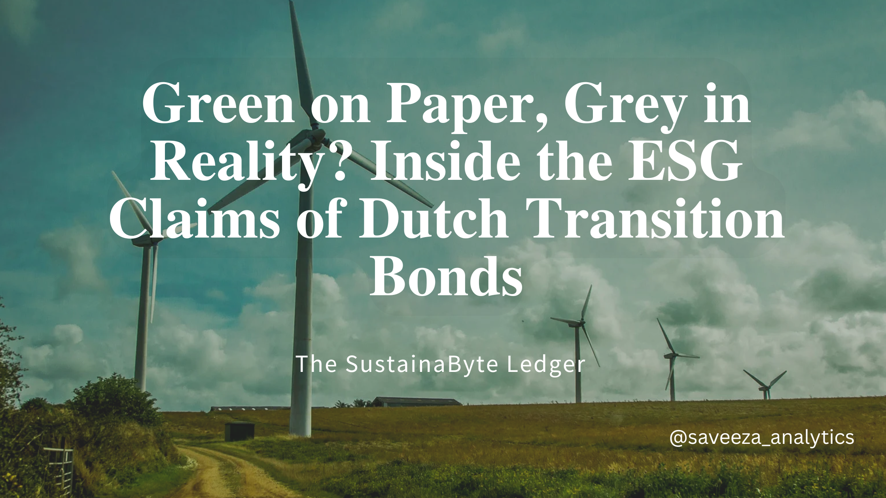

# 🇳🇱 Dutch Pension Funds and the Transition Bond Credibility Gap  
### 📊 A Deep-Dive into ESG Risk, Taxonomy Scoring, and Sustainable Finance Data Integrity

[](https://mybinder.org/v2/gh/saveeza/transition-bonds-netherlands-pension-risk-analysis/HEAD)

---

## 📘 Overview

This repository supports the article:  
**[Dutch Pension Funds’ Bet on Transition Bonds: Data Shows a Credibility Gap?](https://www.linkedin.com/pulse/dutch-pension-funds-credibility-challenge-transition-bonds-chaudhry--g2jje)**

We conducted a multi-stage data-driven audit of transition bonds held by four major Dutch pension funds (ABP, PFZW, PME, and PMT). Using over 1,000 pages of disclosures, we extracted and scored bond-level alignment with the EU Taxonomy, verified KPI disclosures, and modeled exposure to stranded asset risk under different climate scenarios.

---

## 🔍 Key Findings

- ✅ **Only 37% of bond proceeds** were fully aligned with EU Taxonomy thresholds
- ❌ **60% of reported KPIs** lacked third-party assurance or science-based benchmarks
- ⚠️ Up to **€2.1 billion at risk** of being stranded under revised EU climate rules
- 📉 PME and PMT had the lowest average bond credibility scores
- 🔄 Misclassification found between SFDR Article 9 and actual environmental performance

---

## 🖼️ Visual Gallery

| Visual | Description |
|--------|-------------|
| **Figure 1** | Growth of transition bond holdings (2020–2023) across Dutch pension funds |
| **Figure 2** | EU Taxonomy alignment levels of transition bonds |
| **Figure 3** | KPI verification status (self-reported vs. externally assured)
| **Table 1** | Bond scoring breakdown by sector and SFDR classification |
| **Table 2** | Sectoral exposure to transition risk (€ millions) |

> All figures and tables are located in the `visuals/` folder.

---

## 🧠 Technical Framework

### 🛠 Tools Used
- Python (tabula-py, pandas, matplotlib, seaborn)
- Excel (pivot tables, formula-based scoring, cross-validation)
- Jupyter Notebooks (for scoring logic, scenario modeling, visual generation)
- Binder (for public, reproducible access)

### 🧪 Analysis Performed
- Manual extraction of bond disclosures from SFDR templates and reports (2020–2023)
- Scoring model for EU taxonomy alignment
- KPI audit and classification (verified vs internal benchmarks)
- Sectoral heatmapping of climate risk exposure
- Scenario simulation for potential stranded asset losses
- Portfolio-level inconsistencies flagged between stated SFDR classification and real-world impact

---

## 🧱 Repository Structure

```
📦 transition-bonds-netherlands-pension-risk-analysis
├── 📄 article/
│   └── Dutch Pension Funds and the Credibility Challenge of Transition Bonds.pdf
├── 📁 data/
│   └── Extracted and cleaned datasets used for scoring, modeling, and visuals
├── 📁 visuals/
│   └── Project figures and charts used in the article and README
├── 📁 notebooks/
│   ├── data_extraction.ipynb
│   ├── taxonomy_scoring_model.xlsx
│   ├── scenario_modeling.ipynb
│   └── verification_analysis.ipynb
└── 📄 README.md
```


---

## 🚧 Barriers, Risks, and Misconduct Potential

- ⚠️ Inconsistent disclosure formats across funds
- 🧾 Lack of mandatory KPI verification
- 🔐 Internal KPI creation without third-party assurance
- 📉 Misuse of SFDR Article 9 classification
- 🔍 Insufficient sectoral stress testing for high-risk investments

---

## 🧭 Policy Implications and Strategic Recommendations

| Recommendation | Impact |
|----------------|--------|
| ✅ Mandatory third-party KPI audits | Improves ESG disclosure credibility |
| ✅ Clarify Taxonomy-SFDR alignment thresholds | Minimizes greenwashing loopholes |
| ✅ Fund-level scenario stress testing | Identifies sectoral risk concentrations |
| ✅ Interactive ESG dashboards | Enhances transparency for regulators & stakeholders |
| ✅ Enforcement against mislabeling | Reduces credibility risk in transition bond markets |

---

## 📢 Call to Action

🔎 **For Dutch and EU financial policymakers, pension analysts, and ESG strategists:**

- Assess your SFDR Article 9 allocations using real taxonomy data
- Audit internal KPIs for climate science alignment and assurance
- Adopt multi-variable scoring systems to validate fund-level alignment
- Use heatmaps and simulations to prepare for upcoming policy tightening

📄 Read the full research here:  
[LinkedIn Article](https://www.linkedin.com/pulse/dutch-pension-funds-credibility-challenge-transition-bonds-chaudhry--g2jje)

---

## 📄 PDF Download

Offline or academic reference:  
[`Dutch Pension Funds and the Credibility Challenge of Transition Bonds.pdf`](article/Dutch%20Pension%20Funds%20and%20the%20Credibility%20Challenge%20of%20Transition%20Bonds.pdf)

---

## ✅ Project Status

- [x] Article completed and peer-reviewed
- [x] Data cleaned, structured, and stored in `/data/`
- [x] Custom scoring model developed
- [x] All visuals rendered and described
- [x] Jupyter Notebooks created and documented
- [x] Policy recommendations integrated
- [x] Binder access enabled
- [x] GitHub structure finalized
- [x] Ready for collaboration or academic use

---

## About the Author

Sustainable finance data analyst focused on ESG taxonomy, climate policy, and high-complexity financial analysis in support of Europe's Green Deal. Experienced in Python, Excel, and policy-relevant sustainability modeling.

---

